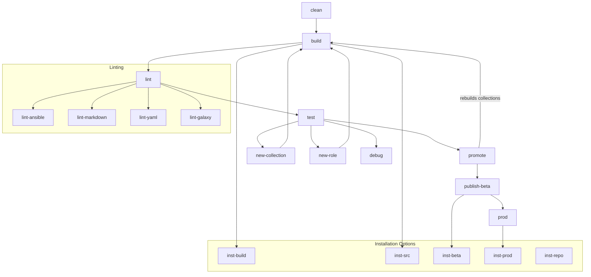

<!--
Copyright (c) 2025 the owner of https://github.com/levonk. Licensed under the GNU AGPL-3.0 License.
See LICENSE file in the project root for full license information.
-->

# levonk-ansible-galaxy

This repository contains a collection of Ansible roles for managing and provisioning development and operational environments.

## Repository Structure

```
.
├── ansible-galaxy/                 # Main project directory
│   ├── bin/                       # Executable scripts for the project
│   │   ├── promote-versions.sh    # Script to increment collection versions
│   │   └── publish-*.sh        # Script to publish on galaxy servers
│   │   └── install-*.sh        # Script to install
│   ├── collections/               # Ansible collections
│   │   └── blueprint_collections/ # A template collection
│   │   └── ansible_collections/
│   │       └── levonk/           # Our collection namespace
│   │           ├── collection1/   # Individual collection
│   │           │   ├── roles/    # Roles within the collection
│   │           │   └── galaxy.yml
│   │           └── ...
│   ├── dist/                      # Built collection artifacts (*.tar.gz)
│   ├── .markers/                  # Marker files for build tracking
│   └── Makefile                   # Main Makefile for project operations
├── docs/                          # Documentation files
└── tests/                         # Test playbooks and test data
```

### Key Directories

- **ansible-galaxy/bin/**: Contains executable scripts for various operations like version promotion and publishing.
- **ansible-galaxy/collections/ansible_collections/levonk/**: Houses all collections under the `levonk` namespace.
  - Each subdirectory represents a collection (e.g., `vibeops/`, `server_llmchat/`).
  - Each collection contains its `roles/` directory and `galaxy.yml`.
- **ansible-galaxy/dist/**: Stores built collection artifacts (`.tar.gz` files) ready for publishing.
- **ansible-galaxy/.markers/**: Tracks build state with marker files for incremental builds.
- **tests/**: Contains test playbooks and related files for testing collections.

### Important Files

- **Makefile**: The main interface for all project operations (building, testing, publishing).
- **galaxy.yml**: Defines collection metadata and requirements.
- **ansible.cfg**: Local Ansible configuration (if present).

## Development Workflow

1. **Collection Development**: Work within `ansible-galaxy/collections/ansible_collections/levonk/{collection_name}`
2. **Building**: Use `make build` to create distribution artifacts in `dist/`
3. **Testing**: Run `make test` to execute tests
4. **Versioning**: Use `make promote` to increment versions before publishing
5. **Publishing**: Use `make publish-beta` or `make prod` to publish to respective servers

## Makefile Targets

The project uses a Makefile to automate various tasks. Here are the available targets:

### Build and Test

- `build`: Build all collections and create distribution artifacts
  - Run with `V=1` for verbose output (e.g., `make V=1 build`)
- `clean`: Clean the distribution directory
- `test`: Run tests for all collections
- `lint`: Run all linting checks
- `lint-ansible`: Lint Ansible roles and playbooks
- `lint-markdown`: Lint Markdown files
- `lint-yaml`: Lint YAML files
- `lint-galaxy`: Lint galaxy.yml files
- `molecule`: Run molecule tests for roles

### Version Management and Publishing

- `promote`: Increment minor version numbers for collections that already exist on the beta server
- `publish-beta`: Publish collections to the beta server (depends on promote)
- `beta`: Alias for publish-beta
- `prod`: Publish collections to the production server (requires being on env/prod branch)

### Installation

- `inst-src`: Install collections from source directories
- `inst-repo`: Install collections from git repository
- `inst-build`: Install collections from built artifacts
- `inst-beta`: Install collections from beta server
- `inst-prod`: Install collections from production server

### Development

- `new-collection`: Create a new collection
- `new-role`: Create a new role within a collection
- `debug`: Run debugging tools

### Target Dependencies



## Makefile Reference

This project uses a Makefile to automate common development tasks. Below is a reference of all available targets.

### Build & Test

| Target | Description |
|--------|-------------|
| `all` | Build and test all collections (default) |
| `build` | Build all collections |
| `check` | Run all checks (lint + test) |
| `clean` | Remove build artifacts |
| `coverage` | Generate test coverage report |
| `lint-ansible` | Lint Ansible content |
| `lint-galaxy` | Lint galaxy.yml files |
| `lint` | Run all linters |
| `lint-markdown` | Lint Markdown files |
| `lint-yaml` | Lint YAML files |
| `test` | Run tests on all collections |

### Collection Management

| Target | Description |
|--------|-------------|
| `new-collection` | Create a new collection |
| `new-role` | Create a new role in a collection |
| `promote-build` | Promote with build version increment |
| `promote-major` | Promote with major version increment |
| `promote` | Alias for promote-build |
| `publish-beta` | Publish to beta server |
| `prod` | Publish to production server |

### Installation Methods

| Target | Description |
|--------|-------------|
| `inst-beta` | Install from beta server |
| `inst-build` | Install from built artifacts |
| `inst-prod` | Install from production server |
| `inst-repo` | Install from git repository |
| `inst-src` | Install from source directories |

### Execution Environment

| Target | Description |
|--------|-------------|
| `ee-build` | Build the execution environment image |
| `ee-clean` | Clean up execution environment images |
| `ee-lint` | Run linters in the execution environment |
| `ee-shell` | Start a shell in the execution environment |
| `ee-test` | Run tests in the execution environment |

### Development

| Target | Description |
|--------|-------------|
| `docs` | Generate documentation |
| `env` | Set up development environment |
| `help` | Show this help message |
| `status` | Show project status |
| `sync` | Sync with remote repository (git rebase) |
| `version` | Show project version |
| `watch` | Watch for changes and run tests |

## Installation Methods

This project provides several ways to install collections, each suitable for different use cases. All installation methods are available as Makefile targets in `ansible-galaxy/Makefile` and as individual scripts in `ansible-galaxy/bin/`.

### Available Installation Methods

1. **From Source**
   - **Use case**: Development and testing of local changes
   - **Make target**: `make inst-src [collection1 collection2 ...]`
   - **Script**: `./bin/install-from-src.sh [collection1 collection2 ...]`
   - **Description**: Installs collections directly from the source directories. This is the fastest way to test local changes without building or publishing.

2. **From Git Repository**
   - **Use case**: Installing from a specific branch or tag
   - **Make target**: `make inst-repo [branch] [collection1 collection2 ...]`
   - **Script**: `./bin/install-from-repo.sh [branch] [collection1 collection2 ...]`
   - **Description**: Clones the repository (or a specific branch) and installs collections from it. Useful for testing changes from a feature branch or specific version.

3. **From Build Artifacts**
   - **Use case**: Testing built collections before publishing
   - **Make target**: `make inst-build [collection1 collection2 ...]`
   - **Script**: `./bin/install-from-build.sh [collection1 collection2 ...]`
   - **Description**: Installs collections from the built artifacts in the `dist/` directory. This verifies that the built packages work as expected.

4. **From Beta Server**
   - **Use case**: Testing collections in a staging environment
   - **Make target**: `make inst-beta [collection1 collection2 ...]`
   - **Script**: `./bin/install-from-beta.sh [collection1 collection2 ...]`
   - **Description**: Installs collections from the beta server (galaxy-dev.ansible.com). Requires authentication if the collections are not public.

5. **From Production Server**
   - **Use case**: Production deployment
   - **Make target**: `make inst-prod [collection1 collection2 ...]`
   - **Script**: `./bin/install-from-prod.sh [collection1 collection2 ...]`
   - **Description**: Installs collections from the production Ansible Galaxy server (galaxy.ansible.com).

### Examples

```bash
# Install all collections from source (development)
make inst-src

# Install specific collections from source
make inst-src common gamer

# Install all collections from a specific git branch
make inst-repo feature/new-feature

# Install specific collections from build artifacts
make inst-build base_system user_setup

# Install all collections from beta server
make inst-beta

# Install specific collections from production
make inst-prod common base_system
```

### Configuration

For server-based installations (beta/production), you may need to set up authentication:

1. Get your API token from [Ansible Galaxy](https://galaxy.ansible.com/me/preferences)
2. Set the token as an environment variable:
   ```bash
   export ANSIBLE_GALAXY_TOKEN=your_token_here
   ```

### Testing After Installation

All installation methods will automatically run any available test playbooks after installation. Test playbooks should be named following these conventions:
- Collection-specific: `tests/test-levonk.{collection_name}.yml`
- Namespace-wide: `tests/test-levonk.yml`

## Publishing Collections

### Publish to Beta Server

Publish collections to the beta server for testing:

```bash
make beta
```

### Publish to Production

Publish collections to the production Ansible Galaxy server:

```bash
make prod
```

## Local Development

### CLI Method for Testing

For one-off testing without installation, you can tell Ansible to use a specific collections path:

```bash
ansible-playbook your_playbook.yml -c {repo-root}/ansible-galaxy/collections/
```

### Modify Your ansible.cfg

This is what the repo structure looks like:

```bash
{repo-root}/
  └── ansible-galaxy/
	  └── collections/ (point `~/.ansible/ansible.cfg [defaults]\n collection_paths={repo-root}/collections:...`)
	      └── ansible_collections/
		  └── levonk/
		      └── base_system/
			  ├── roles/
			  │   └── base_system/
			  │       └── tasks/
			  │           └── main.yml
			  ├── galaxy.yml (Required but can be minimal)
			  └── README.md (Recommended)
```

Key points:

1. ansible-galaxy: This is your top-level project directory. It can be named anything.
2. collections: This must be named collections. Ansible looks for collections here by default (when you configure the collections_paths).
3. ansible_collections: This must also be named ansible_collections.
4. levonk: Your namespace.
5. base_system: Your collection name.
6. roles: This contains the actual roles.
7. base_system (inside roles): The actual role directory containing tasks, handlers, vars, etc.
8. galaxy.yml: A basic galaxy.yml file is required.


When you run `ansible-playbook your_playbook.yml` from within `{repo-root}/`, Ansible will:
1. Find ansible.cfg in the same directory.
2. Read the `collections_paths` setting from that file.
3. Search `./{repo-root}/ansible-galaxy/collections/` first. Since `your_playbook.yml` and `ansible-galaxy` are in the same directory, `./` refers to that directory.
4. Find `levonk.base_system` in `ansible-galaxy/collections/ansible_collections/levonk/base_system`.
5. Run the role.

`~/.ansible/ansible.cfg` should read
```ini
[defaults]
collection_paths={repo-root}/ansible-galaxy/collections:{the-other-paths}

```
-     `./ansible-galaxy/collections/`: This is the crucial part. It tells Ansible to look relative to your playbook's location inside the ansible-galaxy/collections/ directory. Make sure you replace ansible-galaxy with the name of your actual directory. Crucially, if your ansible.cfg is in the same directory as your playbook, ./ refers to that playbook's directory. If your ansible.cfg is in ~/.ansible, then ./ is relative to your home directory, not your playbook's location.
-     `~/.ansible/collections`: This is included to keep the standard user-level collection path in the search order.
-     `/usr/share/ansible/collections`: This keeps the system-wide collection path in the search order.
