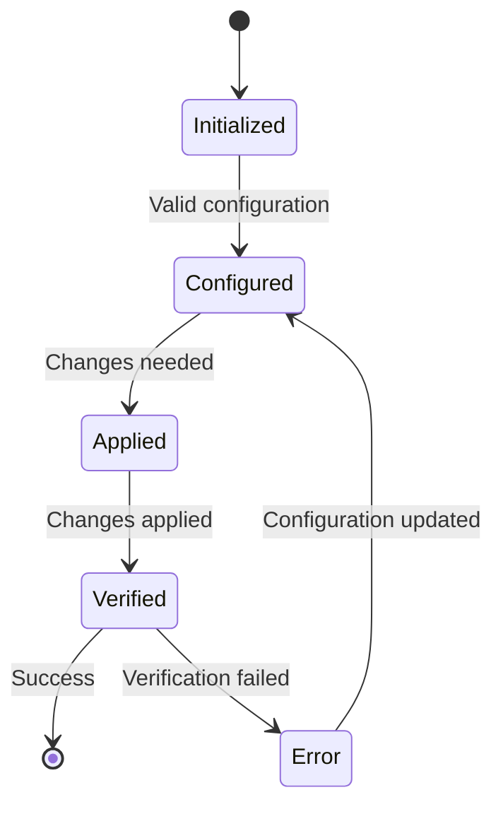

# {{ collection_name }} Collection Architecture

## Overview

This document provides a comprehensive architectural overview of the `{{ collection_name }}` Ansible collection. It's designed to help contributors understand the design principles, components, and interactions within the collection.

## Table of Contents

- [Architectural Overview](#architectural-overview)
- [Design Principles](#design-principles)
- [Component Architecture](#component-architecture)
- [Data Flow](#data-flow)
- [Security Model](#security-model)
- [Performance Considerations](#performance-considerations)
- [Scaling Guidelines](#scaling-guidelines)
- [Extension Points](#extension-points)
- [Dependencies](#dependencies)
- [Future Enhancements](#future-enhancements)

## Architectural Overview

```mermaid
graph TD
    A[User Playbook] -->|Uses| B[{{ collection_name }} Collection]
    B --> C[Core Modules]
    B --> D[Custom Plugins]
    B --> E[Roles]
    C --> F[System Components]
    D --> F
    E --> F
    F --> G[Target Systems]
```

## Design Principles

1. **Modularity**
   - Each component is self-contained with clear interfaces
   - Minimal inter-dependencies between modules/roles

2. **Idempotency**
   - All operations are idempotent by design
   - State verification before making changes

3. **Security First**
   - Principle of least privilege
   - Sensitive data handling with Ansible Vault
   - Input validation and sanitization

4. **Extensibility**
   - Clear extension points for customization
   - Plugin architecture for additional functionality

## Component Architecture

### Core Modules

| Module | Purpose | Dependencies |
|--------|---------|--------------|
| `module1` | Brief description | `dependency1`, `dependency2` |
| `module2` | Brief description | `dependency3` |

### Plugin System

```yaml
plugins/
  action/           # Custom action plugins
  filter/           # Custom Jinja2 filters
  lookup/           # Custom lookup plugins
  module_utils/     # Shared module utilities
```

### Role Structure

```yaml
roles/
  role_name/
    defaults/     # Default variables (lowest precedence)
    vars/         # Role variables
    tasks/        # Task definitions
    handlers/     # Handlers
    templates/    # Template files
    files/        # Static files
    meta/         # Dependencies and metadata
```

## Data Flow

### Playbook Execution Flow

1. **Initialization**
   - Load collection components
   - Validate input parameters
   - Establish connections

2. **Execution**
   - Apply configuration
   - Manage state
   - Handle dependencies

3. **Verification**
   - Validate changes
   - Generate reports
   - Handle errors

### State Management



## Security Model

### Authentication

- **SSH Key-based** for remote systems
- **API Tokens** for service integration (stored in vault)
- **Vault Encryption** for sensitive data

### Access Control

- Role-based access control (RBAC)
- Principle of least privilege
- Audit logging for all operations

### Data Protection

- Sensitive data encrypted at rest
- Secure credential handling
- No sensitive data in logs

## Performance Considerations

### Optimization Techniques

- **Bulk Operations**: Where possible, use bulk operations
- **Conditional Execution**: Skip unnecessary tasks
- **Asynchronous Tasks**: For long-running operations
- **Connection Pooling**: Reuse connections when possible

### Resource Requirements

| Component | CPU | Memory | Storage |
|-----------|-----|--------|---------|
| Control Node | 2 cores | 4GB | 10GB |
| Managed Node | 1 core | 2GB | 5GB |

## Scaling Guidelines

### Vertical Scaling

- Increase control node resources for larger inventories
- Adjust `forks` parameter in ansible.cfg
- Tune SSH connection settings

### Horizontal Scaling

- Use dynamic inventories
- Implement worker nodes for parallel execution
- Consider Ansible Tower/AWX for large-scale deployments

## Extension Points

### Custom Plugins

1. **Action Plugins**
   - Extend module functionality
   - Add custom behaviors

2. **Filter Plugins**
   - Custom Jinja2 filters
   - Data transformation

3. **Lookup Plugins**
   - Custom data sources
   - External system integration

### Callback Plugins

- Custom output formatting
- Integration with monitoring systems
- Enhanced logging

## Dependencies

### Internal Dependencies

```yaml
# collections/requirements.yml
collections:
  - name: community.general
    version: '>=3.0.0'
  - name: ansible.posix
    version: '>=1.3.0'
```

### External Dependencies

| Dependency | Version | Purpose |
|------------|---------|---------|
| Python | 3.6+ | Runtime environment |
| Ansible | 2.9+ | Automation platform |
| Docker | 20.10+ | Container runtime (if applicable) |

## Future Enhancements

### Short-term

1. [ ] Add support for additional platforms
2. [ ] Implement performance optimizations
3. [ ] Enhance test coverage

### Long-term

1. [ ] Add AI/ML-based optimization
2. [ ] Implement advanced monitoring integration
3. [ ] Develop web-based management interface

## Appendix

### Related Documents

- [Developer Guide](developer-guide.md)
- [API Reference](api-reference.md)
- [Troubleshooting Guide](troubleshooting.md)

### Glossary

| Term | Definition |
|------|------------|
| Term 1 | Definition 1 |
| Term 2 | Definition 2 |

---

*Document generated on: {{ "now" | strftime("%Y-%m-%d") }}*  
*Version: {{ collection_version | default('1.0.0') }}*

Copyright (c) 2025 the owner of https://github.com/levonk. Licensed under the GNU AGPL-3.0 License.
See LICENSE file in the project root for full license information.
